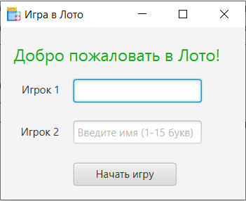
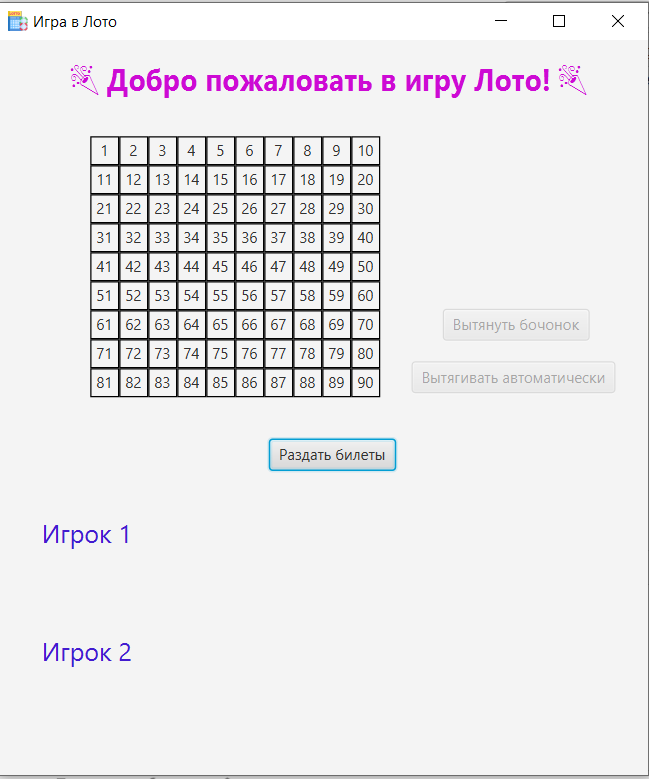
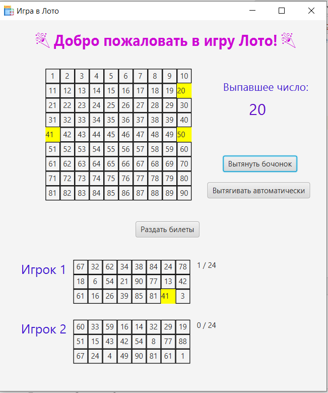
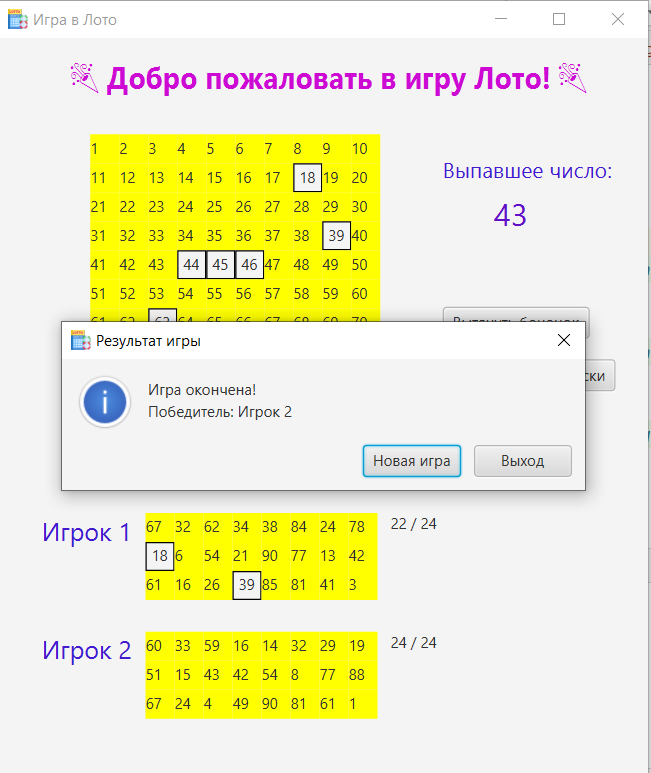

# Lotto Game

## Описание

**Lotto Game** — это лотерея для двух игроков, реализованная на Java с использованием JavaFX. Игроки по очереди тянут случайные числа, и если число совпадает с числом на их билете, оно отмечается. Игра заканчивается, когда один из игроков закроет все числа на своем билете, и этот игрок становится победителем.

## Особенности

- Поддержка двух игроков.
- Раздача билетов перед началом игры.
- Рандомный выбор чисел (вытягивание бочонка).
- Автоматический розыгрыш чисел по кнопке.
- Отображение текущего состояния игры в графическом интерфейсе.
- Победитель определяется, когда все числа на его билете закрыты.

## Основные элементы управления

- **Раздать билеты** — кнопка, которая раздает случайные билеты каждому игроку перед началом игры.
- **Вытянуть бочонок** — кнопка для вытягивания одного случайного числа (бочонка).
- **Автоматический розыгрыш** — кнопка для автоматического вытягивания чисел до завершения игры.

## Технологии

- **Java** — основной язык программирования.
- **JavaFX** — для создания графического интерфейса.
- **Maven** — для управления зависимостями (если используется).

## Установка и запуск

1. Клонируйте репозиторий:
    ```bash
    git clone https://github.com/username/lotto-game.git
    ```

2. Перейдите в директорию проекта:
    ```bash
    cd lotto-game
    ```

3. Откройте проект в вашей IDE (например, IntelliJ IDEA).

4. Запустите проект через класс `Main.java`.

## Пример использования

1. Запустите приложение.
2. Введите имена игроков (по желанию).
3. Нажмите кнопку "Начать игру" для старта.
4. Нажмите кнопку **"Раздать билеты"**, чтобы выдать случайные билеты игрокам.
5. Нажмите кнопку **"Вытянуть бочонок"**, чтобы вытянуть случайное число.
6. Либо нажмите **"Автоматический розыгрыш"**, чтобы вытягивать числа автоматически, пока один из игроков не победит.
7. Следите за результатами на экране — когда все числа на билете одного игрока закрыты, игра заканчивается.
8. После завершения игры у вас есть два варианта:
      - Нажмите "Новая игра", чтобы начать новую игру с теми же игроками.
      - Нажмите "Выход", чтобы завершить приложение и выйти.


## Скриншоты

1. Начальный экран:
   

2. Экран игры:
   

3. Игра в процессе:
   

4. Конец игры:
   

